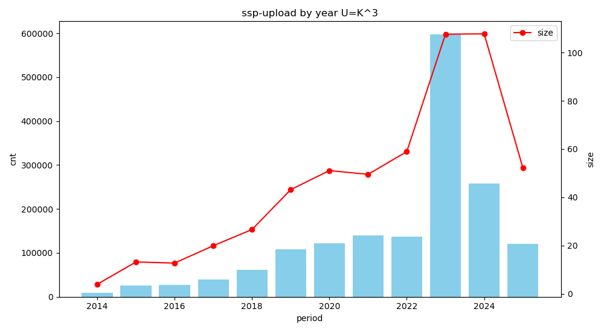
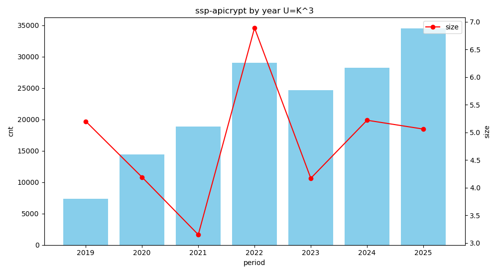
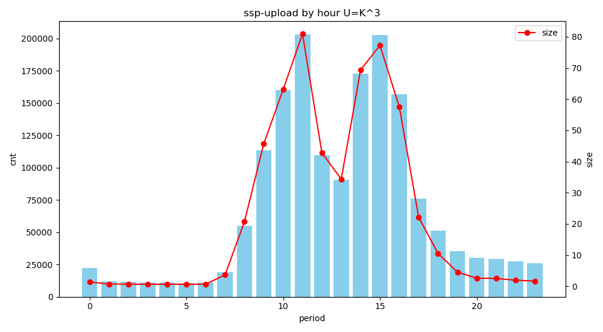
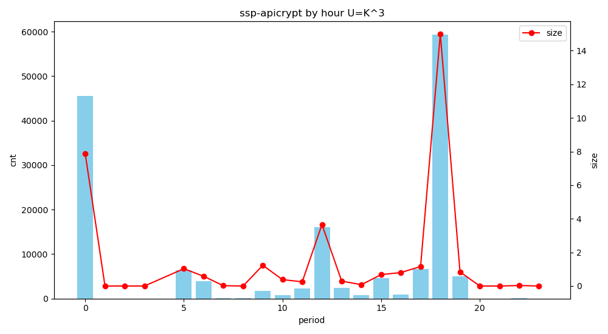

<!--
(delete-matching-lines "INFRADESK-nnnn")
(delete-matching-lines "INFRA-nnnn")
-->

```yml
nodes: [ profnte1, prostri1 ]
tickets: [ INFRA-2301 ]
repos: [ jqsh ]
dates: [ 2025-10-17 ]
```

[2025-10-16 Space-evol]:
    ../../2025/2025-10-16-space-evol/space-evol.md
    "sibling file"

<!-- Related -->

[2025-08-01 Prostrc1-space]:
    ../../2025/2025-08-01-prostrc1-space/prostrc1-space.md
    "sibling file"

<!-- Repos -->

[jqsh]:
    https://github.com/Epiconcept-Paris/jqsh
    "github.com repo"

[infra-lib-2023]:
    https://github.com/Epiconcept-Paris/infra-lib-2023
    "github.com repo"

[infra-fact-2023]:
    https://github.com/Epiconcept-Paris/infra-fact-2023
    "github.com repo"

[infra-node-groups-data-2025]:
    https://github.com/Epiconcept-Paris/infra-node-groups-data-2025
    "github.com repo"

[infra-data-ips-2025]:
    https://github.com/Epiconcept-Paris/infra-data-ips-2025
    "github.com repo"

[infra-data-2023]:
    https://github.com/Epiconcept-Paris/infra-data-2023
    "github.com repo"

[infra-play-2025]:
    https://github.com/Epiconcept-Paris/infra-play-2025
    "github.com repo"

[infra-play-2023]:
    https://github.com/Epiconcept-Paris/infra-play-2023
    "github.com repo"

<!-- Tickets -->

[INFRA-2301]: https://epiconcept.atlassian.net/browse/INFRA-2301 "epiconcept.atlassian.net"

# TL;DR

- Still mostly a POC
- Fetch all `[ timestamp, size, path ]` for `ssp/apicrypt` and `ssp/upload`
- Use `duckdb` (really fast)
- Query total count and size by year and hour
- Show plots

## For `upload`

```bash
period=%Y power=3 size-by-period ssp-upload
period=%Y power=3 fmt=csv plot-size-by-period ssp-upload year
```

| period |  cnt   |  size  |
|--------|-------:|-------:|
| 2014   | 9638   | 3.91   |
| 2015   | 26082  | 13.17  |
| 2016   | 27240  | 12.71  |
| 2017   | 39428  | 19.92  |
| 2018   | 61738  | 26.63  |
| 2019   | 108665 | 43.16  |
| 2020   | 122227 | 51.09  |
| 2021   | 139157 | 49.52  |
| 2022   | 137242 | 58.95  |
| 2023   | 597295 | 107.67 |
| 2024   | 257394 | 107.8  |
| 2025   | 121131 | 52.2   |




## For `apicrypt`

```bash
period=%Y power=3 size-by-period ssp-apicrypt
period=%Y power=3 fmt=csv plot-size-by-period ssp-apicrypt year
```

| period |  cnt  | size |
|--------|------:|-----:|
| 2019   | 7398  | 5.2  |
| 2020   | 14398 | 4.19 |
| 2021   | 18862 | 3.15 |
| 2022   | 29026 | 6.89 |
| 2023   | 24695 | 4.17 |
| 2024   | 28223 | 5.22 |
| 2025   | 34494 | 5.06 |



<!-- markdown-toc-generate-toc -->
<!-- https://bugs.debian.org/cgi-bin/bugreport.cgi?bug=1036359 -->
<!--
mkdir -p tmp; pandoc README.md -t jira > tmp/README.jira
< README.md pandoc -f gfm -t gfm --toc --toc-depth=6 --template ../toc.md --columns=196 | grep -v Table.of.Contents
-->

# Table of Contents

<details><summary>Expand</summary>

-   [TL;DR](#tldr)
    -   [For `upload`](#for-upload)
    -   [For `apicrypt`](#for-apicrypt)
-   [See also](#see-also)
-   [Per request INFRA-2301](#per-request-infra-2301)
-   [Env](#env)
-   [Tools](#tools)
    -   [Install `jqsh`](#install-jqsh)
        -   [Clone a specified `jqsh` tag](#clone-a-specified-jqsh-tag)
        -   [Add cloned repo `cmd` dir to `PATH`](#add-cloned-repo-cmd-dir-to-path)
        -   [Source `jqsh` from cloned repo](#source-jqsh-from-cloned-repo)
-   [Add lib](#add-lib)
-   [Install `duckdb`](#install-duckdb)
-   [Init](#init)
-   [First try](#first-try)
    -   [Smallest set `ssp-apicrypt`](#smallest-set-ssp-apicrypt)
        -   [Fetch all `[ timestamp, size, path ]`](#fetch-all--timestamp-size-path-)
        -   [Load fetched data in a `duckdb` DB](#load-fetched-data-in-a-duckdb-db)
        -   [First sigth on DB](#first-sigth-on-db)
        -   [First useful query](#first-useful-query)
    -   [Biggest one `ssp-upload`](#biggest-one-ssp-upload)
        -   [Fetch all `[ timestamp, size, path ]`](#fetch-all--timestamp-size-path--1)
        -   [Load fetched data in a `duckdb` DB](#load-fetched-data-in-a-duckdb-db-1)
        -   [First sigth on DB](#first-sigth-on-db-1)
        -   [First useful query](#first-useful-query-1)
-   [More stuff](#more-stuff)
    -   [By hour](#by-hour)
    -   [Paranoid check](#paranoid-check)
    -   [Try plot](#try-plot)

</details>

# See also

<details><summary>Expand</summary>

- [2025-08-01 Prostrc1-space][]

</details>

# Per request INFRA-2301

- [INFRA-2301][] Evolution espace disque

- **Priority** Medium
- **Description**

    - evaluation de l’esapce disque SSP prod  : 
    - serveur front : profnte1
    - dossier : /space/applisdata/ssp

# Env

```bash
declare -p INFRA
```

# Tools

## Install `jqsh`

- [jqsh][]

### Clone a specified `jqsh` tag

- Last known working tags (default to last)

```bash
last=$(git -C $INFRA/jqsh tag | sort | tail -1)
```

---

```bash
if [[ $USER == thy ]] then export GIT_SSH_COMMAND='ssh -i ~/.ssh/t.delamare@epiconcept.fr -F /dev/null'; fi
repo=git@github.com:Epiconcept-Paris/jqsh.git
tag=$last jqsh=tmp/jqsh-$tag; mkdir -p $jqsh
git clone -b $tag --depth 1 $repo $jqsh
ln -nsf jqsh-$tag tmp/jqsh
```

### Add cloned repo `cmd` dir to `PATH`

```bash
source $jqsh/cmd/addpath.sh $jqsh/cmd
```

### Source `jqsh` from cloned repo

```bash
source jqsh.sh
```

# Add lib

- Import [space-stat.yml][] from [2025-08-01 Prostrc1-space][]
- Derive [space-evol.yml][] from [space-stat.yml][]

```bash
load space-evol.yml
```

# Install `duckdb`

> [!NOTE]
>
> - Once only

```bash
install-duckdb
```

# Init

```bash
stone
```

# First try

## Smallest set `ssp-apicrypt`

```bash
var ssp-apicrypt | yq -P
```

---

```yaml
what: profnte1:/space/applisdata/ssp/apicrypt
node: prostri1
path: /space/nfsdata/profnte1/applisdata/ssp/apicrypt
```

### Fetch all `[ timestamp, size, path ]`

```console
thy@tdews1-256g:2025-10-16-space-evol$ time mk-files-stat ssp-apicrypt
rem ssp-apicrypt files-stat | gzip > tmp/ssp-apicrypt-stat.js.gz

real	0m14.780s
user	0m1.789s
sys	0m0.281s
```

### Load fetched data in a `duckdb` DB

> [!NOTE]
>
> - That was fast

```console
thy@tdews1-256g:2025-10-16-space-evol$ time create-file-stat-db ssp-apicrypt

real	0m0.434s
user	0m0.298s
sys	0m0.067s
```

### First sigth on DB

```bash
duckdb tmp/ssp-apicrypt-stat.db -markdown -c "SUMMARIZE file_stats;"
```

---

|  column_name   | column_type |                min                 |                    max                    | approx_unique |        avg         |        std        |    q25     |    q50     |    q75     | count  | null_percentage |
|----------------|-------------|------------------------------------|-------------------------------------------|--------------:|--------------------|-------------------|------------|------------|------------|-------:|----------------:|
| unix_timestamp | BIGINT      | 1559815854                         | 1760720504                                | 125696        | 1680141213.4355872 | 56017452.6258132  | 1639352105 | 1682912129 | 1730865857 | 157096 | 0.00            |
| size_bytes     | BIGINT      | 0                                  | 524288224                                 | 121497        | 231578.1669297754  | 2657529.701677757 | 95240      | 181831     | 225712     | 157096 | 0.00            |
| file_path      | VARCHAR     | "./201/Clefs/Gaelle.VAREILLES.124" | "./923/inbox/gli_pdf_101718205801_c2.pdf" | 150491        | NULL               | NULL              | NULL       | NULL       | NULL       | 157096 | 0.00            |

### First useful query

```console
thy@tdews1-256g:2025-10-16-space-evol$ time size-by-year ssp-apicrypt
...

real	0m0.078s
user	0m0.141s
sys	0m0.014s
```

---

| year | number_of_files | total_size_added |
|-----:|----------------:|------------------|
| 2019 | 7398            | 5.2 GB           |
| 2020 | 14398           | 4.19 GB          |
| 2021 | 18862           | 3.15 GB          |
| 2022 | 29026           | 6.89 GB          |
| 2023 | 24695           | 4.17 GB          |
| 2024 | 28223           | 5.22 GB          |
| 2025 | 34494           | 5.06 GB          |

## Biggest one `ssp-upload`

```bash
var ssp-upload | yq -P
```

---

```yaml
what: profnte1:/space/applisdata/ssp/upload
node: prostri1
path: /space/nfsdata/profnte1/applisdata/ssp/upload
```

### Fetch all `[ timestamp, size, path ]`

```console
thy@tdews1-256g:2025-10-16-space-evol$ time mk-files-stat ssp-upload
rem ssp-upload files-stat | gzip > tmp/ssp-upload-stat.js.gz

real	3m26.617s
user	0m15.177s
sys	0m2.950s

thy@tdews1-256g:2025-10-16-space-evol$ ls -lsh tmp/ssp-upload-stat.js.gz 
45M -rw-r--r-- 1 thy thy 45M Oct 17 20:01 tmp/ssp-upload-stat.js.gz
```

### Load fetched data in a `duckdb` DB

> [!NOTE]
>
> - Still pretty fast

```console
thy@tdews1-256g:2025-10-16-space-evol$ time create-file-stat-db ssp-upload

real	0m3.973s
user	0m4.274s
sys	0m0.523s

thy@tdews1-256g:2025-10-16-space-evol$ ls -lsh tmp/ssp-upload-stat.db 
98M -rw-r--r-- 1 thy thy 98M Oct 17 20:04 tmp/ssp-upload-stat.db
```

### First sigth on DB

```bash
duckdb tmp/ssp-upload-stat.db -markdown -c "SUMMARIZE file_stats;"
```

---

|  column_name   | column_type |                              min                              |                                    max                                    | approx_unique |        avg         |        std        |    q25     |    q50     |    q75     |  count  | null_percentage |
|----------------|-------------|---------------------------------------------------------------|---------------------------------------------------------------------------|--------------:|--------------------|-------------------|------------|------------|------------|--------:|----------------:|
| unix_timestamp | BIGINT      | 1405409168                                                    | 1760716723                                                                | 1016708       | 1653489896.910201  | 73388605.85432705 | 1613431050 | 1682366593 | 1698892198 | 1647237 | 0.00            |
| size_bytes     | BIGINT      | 0                                                             | 246425290                                                                 | 602990        | 356394.59181101446 | 635521.9068375753 | 60044      | 126642     | 451554     | 1647237 | 0.00            |
| file_path      | VARCHAR     | "./files_1731959368/.0113776c41c8e546ceecb78287aae81e.bp6BGa" | "./files_1731959368_by_group/99/2024/05/dcde30ad444a2412875cd8698b4763ff" | 1153395       | NULL               | NULL              | NULL       | NULL       | NULL       | 1647237 | 0.00            |

### First useful query

```console
thy@tdews1-256g:2025-10-16-space-evol$ time size-by-year ssp-upload
...

real	0m0.154s
user	0m1.052s
sys	0m0.017s
```

---

| year | number_of_files | total_size_added |
|-----:|----------------:|------------------|
| 2014 | 9638            | 3.91 GB          |
| 2015 | 26082           | 13.17 GB         |
| 2016 | 27240           | 12.71 GB         |
| 2017 | 39428           | 19.92 GB         |
| 2018 | 61738           | 26.63 GB         |
| 2019 | 108665          | 43.16 GB         |
| 2020 | 122227          | 51.09 GB         |
| 2021 | 139157          | 49.52 GB         |
| 2022 | 137242          | 58.95 GB         |
| 2023 | 597295          | 107.67 GB        |
| 2024 | 257394          | 107.8 GB         |
| 2025 | 121131          | 52.2 GB          |

# More stuff

## By hour

```bash
period=%H power=3 size-by-period ssp-upload
```

| period |  cnt   | size  |
|--------|-------:|------:|
| 00     | 22240  | 1.36  |
| 01     | 12001  | 0.72  |
| 02     | 11421  | 0.67  |
| 03     | 11153  | 0.66  |
| 04     | 10883  | 0.64  |
| 05     | 10730  | 0.63  |
| 06     | 11082  | 0.66  |
| 07     | 18866  | 3.67  |
| 08     | 54974  | 20.69 |
| 09     | 113499 | 45.75 |
| 10     | 159958 | 63.1  |
| 11     | 203014 | 80.95 |
| 12     | 109400 | 42.8  |
| 13     | 90385  | 34.36 |
| 14     | 172595 | 69.4  |
| 15     | 202571 | 77.24 |
| 16     | 156749 | 57.53 |
| 17     | 75997  | 22.13 |
| 18     | 51207  | 10.54 |
| 19     | 35315  | 4.55  |
| 20     | 30411  | 2.58  |
| 21     | 29407  | 2.52  |
| 22     | 27248  | 1.93  |
| 23     | 26131  | 1.68  |

```bash
period=%H power=3 size-by-period ssp-apicrypt
```

| period |  cnt  | size  |
|--------|------:|------:|
| 00     | 45519 | 7.86  |
| 01     | 1     | 0.0   |
| 02     | 3     | 0.0   |
| 03     | 1     | 0.0   |
| 05     | 6405  | 1.03  |
| 06     | 3948  | 0.58  |
| 07     | 116   | 0.02  |
| 08     | 115   | 0.0   |
| 09     | 1750  | 1.23  |
| 10     | 816   | 0.38  |
| 11     | 2284  | 0.25  |
| 12     | 16118 | 3.66  |
| 13     | 2463  | 0.29  |
| 14     | 844   | 0.08  |
| 15     | 4631  | 0.68  |
| 16     | 873   | 0.8   |
| 17     | 6713  | 1.16  |
| 18     | 59335 | 14.99 |
| 19     | 4966  | 0.84  |
| 20     | 20    | 0.0   |
| 21     | 2     | 0.0   |
| 22     | 166   | 0.03  |
| 23     | 7     | 0.0   |

## Paranoid check

- See if by year and by hour have equal sum using `json` output

```bash
jq='map(map(numbers)) | transpose | map(add | round)'
sum-num-cols () { period=%${1:?} power=3 fmt=json size-by-period ssp-upload | jq "$jq" -c; }
for i in Y H; do sum-num-cols $i; done
```

---

```json
[1647237,547]
[1647237,547]
```

## Try plot

```bash
period=%Y power=3 fmt=csv plot-size-by-period ssp-upload year
```


```bash
period=%Y power=3 fmt=csv plot-size-by-period ssp-apicrypt year
```


```bash
period=%H power=3 fmt=csv plot-size-by-period ssp-upload hour
```



```bash
period=%H power=3 fmt=csv plot-size-by-period ssp-apicrypt hour
```



<!--
bin=$INFRA/infra-lib-2023/bin
. <(echo ${nodes[@]} | sort | $bin/fmt-nodes.jq)

find -maxdepth 1 -type f | cut -c 3- | grep -v \~ | jq -Rr '"[\(.)]: \(.) \u0027sibling file\u0027", "- [\(.)][]"' | env LANG=C sort
find out -type f | grep -v \~ | jq -Rr '"[\(.)]: \(.) \u0027sibling file\u0027", "- [\(.)][]"' | env LANG=C sort
-->

[space-evol.yml]: space-evol.yml 'sibling file'
[space-stat.yml]: space-stat.yml 'sibling file'

[Local Variables:]::
[indent-tabs-mode: nil]::
[End:]::
