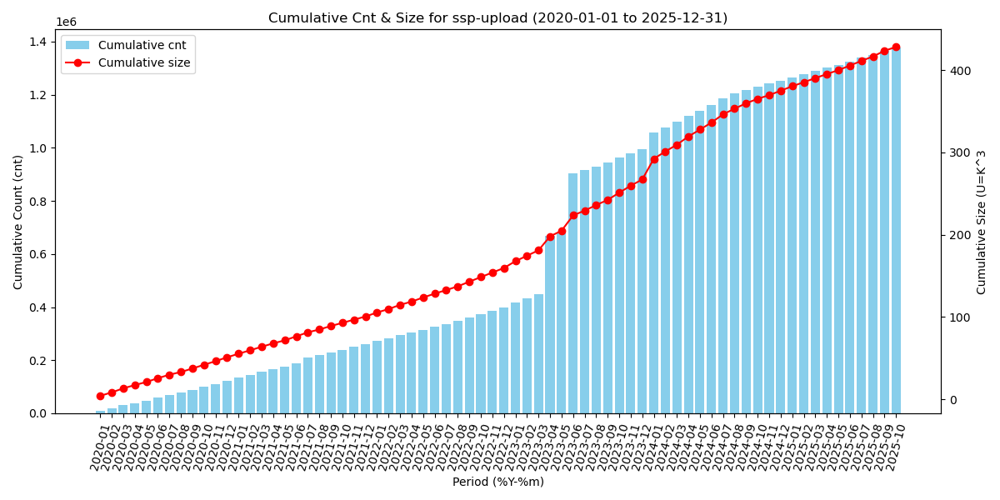
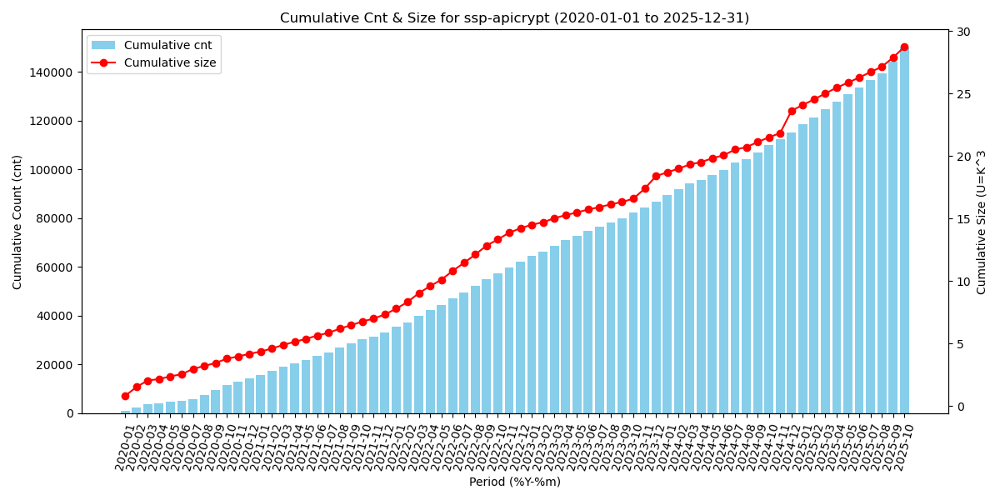
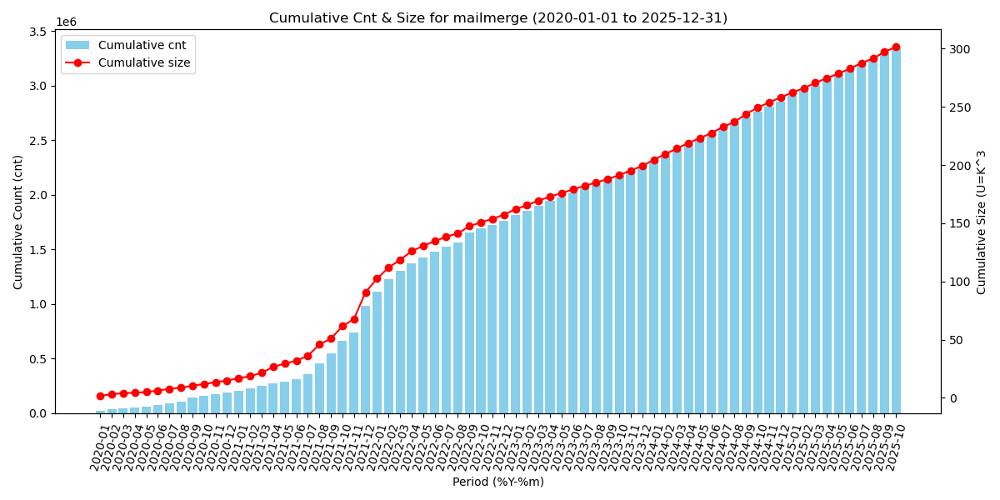
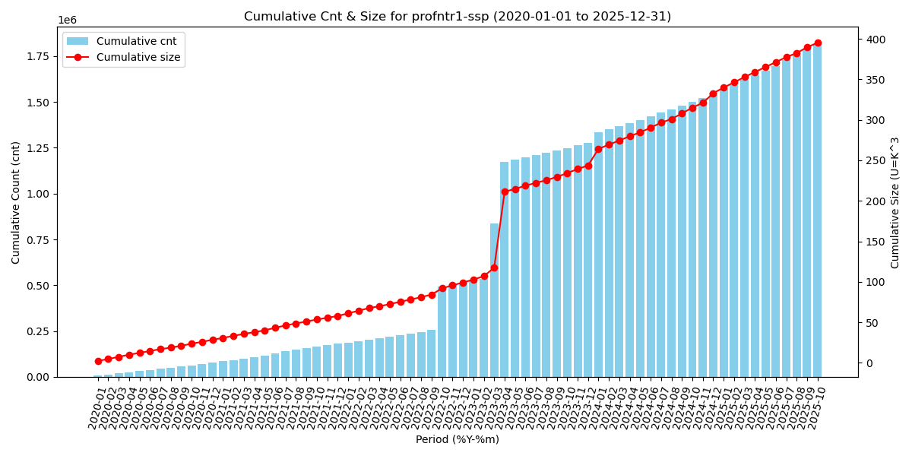

<!--
(delete-matching-lines "INFRADESK-nnnn")
(delete-matching-lines "INFRA-nnnn")
-->

```yml
nodes: [ profnte1, prostri1, prostrc1 ]
tickets: [ INFRA-2301 ]
repos: [ jqsh ]
```

[2025-10-22 Space-evol]:
    ../../2025/2025-10-22-space-evol/space-evol.md
    "sibling file"

<!-- Related -->

[2025-10-16 Space-evol]:
    ../../2025/2025-10-16-space-evol/space-evol.md
    "sibling file"

[2025-08-01 Prostrc1-space]:
    ../../2025/2025-08-01-prostrc1-space/prostrc1-space.md
    "sibling file"

<!-- Repos -->

[jqsh]:
    https://github.com/Epiconcept-Paris/jqsh
    "github.com repo"

[infra-lib-2023]:
    https://github.com/Epiconcept-Paris/infra-lib-2023
    "github.com repo"

[infra-fact-2023]:
    https://github.com/Epiconcept-Paris/infra-fact-2023
    "github.com repo"

[infra-node-groups-data-2025]:
    https://github.com/Epiconcept-Paris/infra-node-groups-data-2025
    "github.com repo"

[infra-data-ips-2025]:
    https://github.com/Epiconcept-Paris/infra-data-ips-2025
    "github.com repo"

[infra-data-2023]:
    https://github.com/Epiconcept-Paris/infra-data-2023
    "github.com repo"

[infra-play-2025]:
    https://github.com/Epiconcept-Paris/infra-play-2025
    "github.com repo"

[infra-play-2023]:
    https://github.com/Epiconcept-Paris/infra-play-2023
    "github.com repo"

<!-- Tickets -->

[INFRA-2301]: https://epiconcept.atlassian.net/browse/INFRA-2301 "epiconcept.atlassian.net"

# TL;DR


```yaml
    ssp:
      path: applisdata/ssp
      sets: [ apicrypt, upload ]
      client:
        node: profnte1
        base: /space
      server:
        node: prostri1
        base: /space/nfsdata
    mailmerge:
      path: applisdata/mailmerge/storage/mailmerge
      client:
        node: proepifiles1
        base: /space
      server:
        node: prostrc1
        base: /space2/nfsdata
    profntr1-ssp:
      path: applisdata
      client:
        node: profntr1
        base: /space
      server:
        node: prostrg1
        base: /space/nfsdata
```






<!-- markdown-toc-generate-toc -->
<!-- https://bugs.debian.org/cgi-bin/bugreport.cgi?bug=1036359 -->
<!--
mkdir -p tmp; pandoc README.md -t jira > tmp/README.jira
< README.md pandoc -f gfm -t gfm --toc --toc-depth=6 --template ../toc.md --columns=196 | grep -v Table.of.Contents
-->

# Table of Contents

<details><summary>Expand</summary>

-   [TL;DR](#tldr)
-   [See also](#see-also)
-   [Per request INFRA-2301](#per-request-infra-2301)
-   [Env](#env)
-   [Tools](#tools)
    -   [Install `jqsh`](#install-jqsh)
        -   [Clone a specified `jqsh` tag](#clone-a-specified-jqsh-tag)
        -   [Add cloned repo `cmd` dir to `PATH`](#add-cloned-repo-cmd-dir-to-path)
        -   [Source `jqsh` from cloned repo](#source-jqsh-from-cloned-repo)
-   [Use `ejq`](#use-ejq)
-   [Add lib](#add-lib)
-   [Install `duckdb`](#install-duckdb)
-   [Fetch all `[ timestamp, size, path ]`](#fetch-all--timestamp-size-path-)
-   [Load fetched data in a `duckdb` DB](#load-fetched-data-in-a-duckdb-db)
-   [Cumulative sum table and plot](#cumulative-sum-table-and-plot)
    -   [Mailmerge](#mailmerge)
    -   [SSP apicrypt](#ssp-apicrypt)
    -   [SSP upload](#ssp-upload)
    -   [profntr1-ssp](#profntr1-ssp)

</details>

# See also

<details><summary>Expand</summary>

- [2025-10-16 Space-evol][]
- [2025-08-01 Prostrc1-space][]

</details>

# Per request INFRA-2301

- [INFRA-2301][] Evolution espace disque

- **Priority** Medium
- **Description**

    - evaluation de l’esapce disque SSP prod  : 
    - serveur front : profnte1
    - dossier : /space/applisdata/ssp

# Env

```bash
declare -p INFRA
```

# Tools

## Install `jqsh`

- [jqsh][]

### Clone a specified `jqsh` tag

- Last known working tags (default to last)

```bash
last=$(git -C $INFRA/jqsh tag | sort | tail -1)
```

---

```bash
if [[ $USER == thy ]] then export GIT_SSH_COMMAND='ssh -i ~/.ssh/t.delamare@epiconcept.fr -F /dev/null'; fi
repo=git@github.com:Epiconcept-Paris/jqsh.git
tag=$last jqsh=tmp/jqsh-$tag; mkdir -p $jqsh
git clone -b $tag --depth 1 $repo $jqsh
ln -nsf jqsh-$tag tmp/jqsh
```

### Add cloned repo `cmd` dir to `PATH`

```bash
source $jqsh/cmd/addpath.sh $jqsh/cmd
```

### Source `jqsh` from cloned repo

```bash
source jqsh.sh
```

# Use `ejq`

```bash
source ejq.sh
```

# Add lib

- Derive [FS-db.yml][] from [../2025-10-16-space-evol/space-evol.yml][]
- Add [data.yml][]

```bash
load FS-db.yml
```

[../2025-10-16-space-evol/space-evol.yml]: ../2025-10-16-space-evol/space-evol.yml "sibling file"

# Install `duckdb`

> [!NOTE]
>
> - Once only

```bash
install-duckdb
```

# Fetch all `[ timestamp, size, path ]`

> [!NOTE]
>
> - We could have skip fetching path nor used for reporting size and cnt evolution

```bash
get-files-stat mailmerge
get-files-stat ssp apicrypt
get-files-stat ssp upload
get-files-stat profntr1-ssp
```

# Load fetched data in a `duckdb` DB

```bash
create-files-stat-db mailmerge
create-files-stat-db ssp apicrypt
create-files-stat-db ssp upload
create-files-stat-db profntr1-ssp
```

# Cumulative sum table and plot

## Mailmerge

```bash
period=%Y power=3 start=2000-01-01 end=2025-12-31 cumulative-size-by-period mailmerge
```

| period |   cnt   |  size  |
|--------|--------:|-------:|
| 2014   | 17849   | 1.01   |
| 2015   | 30001   | 1.75   |
| 2016   | 90367   | 10.51  |
| 2017   | 159746  | 23.02  |
| 2018   | 279051  | 43.9   |
| 2019   | 468170  | 61.56  |
| 2020   | 655879  | 76.41  |
| 2021   | 1453715 | 152.24 |
| 2022   | 2230110 | 218.86 |
| 2023   | 2727838 | 260.87 |
| 2024   | 3321362 | 319.69 |
| 2025   | 3816623 | 363.12 |

```bash
period=%Y-%m power=3 start=2020-01-01 end=2025-12-31 plot-cumulative-size mailmerge 2020-2025-month
```


## SSP apicrypt

```bash
period=%Y power=3 start=2000-01-01 end=2025-12-31 cumulative-size-by-period ssp apicrypt
```

| period |  cnt   | size  |
|--------|-------:|------:|
| 2019   | 7398   | 5.2   |
| 2020   | 21796  | 9.39  |
| 2021   | 40658  | 12.54 |
| 2022   | 69684  | 19.43 |
| 2023   | 94379  | 23.6  |
| 2024   | 122602 | 28.82 |
| 2025   | 157371 | 33.93 |


```bash
    period=%Y-%m power=3 start=2020-01-01 end=2025-12-31 plot-cumulative-size ssp-apicrypt 2020-2025-month
```


## SSP upload

```bash
period=%Y power=3 start=2000-01-01 end=2025-12-31 cumulative-size-by-period ssp upload
```

| period |   cnt   |  size  |
|--------|--------:|-------:|
| 2014   | 9638    | 3.91   |
| 2015   | 35720   | 17.08  |
| 2016   | 62960   | 29.79  |
| 2017   | 102388  | 49.72  |
| 2018   | 164126  | 76.35  |
| 2019   | 272791  | 119.51 |
| 2020   | 395018  | 170.6  |
| 2021   | 534175  | 220.13 |
| 2022   | 671417  | 279.08 |
| 2023   | 1268712 | 386.74 |
| 2024   | 1526106 | 494.55 |
| 2025   | 1649597 | 547.79 |

```bash
period=%Y-%m power=3 start=2020-01-01 end=2025-12-31 plot-cumulative-size ssp-upload 2020-2025-month
```


## profntr1-ssp

```bash
period=%Y power=3 start=2000-01-01 end=2025-12-31 cumulative-size-by-period profntr1-ssp
```

| period |   cnt   |  size  |
|--------|--------:|-------:|
| 2014   | 8982    | 3.34   |
| 2015   | 31299   | 14.37  |
| 2016   | 50349   | 24.04  |
| 2017   | 73624   | 37.78  |
| 2018   | 108898  | 53.17  |
| 2019   | 177631  | 78.05  |
| 2020   | 255237  | 106.65 |
| 2021   | 358889  | 135.91 |
| 2022   | 692347  | 177.24 |
| 2023   | 1454799 | 321.78 |
| 2024   | 1726124 | 410.83 |
| 2025   | 1996544 | 473.16 |

```bash
period=%Y-%m power=3 start=2020-01-01 end=2025-12-31 plot-cumulative-size profntr1-ssp 2020-2025-month
```


<!--
bin=$INFRA/infra-lib-2023/bin
. <(echo ${nodes[@]} | sort | $bin/fmt-nodes.jq)

find -maxdepth 1 -type f | cut -c 3- | grep -v \~ | jq -Rr '"[\(.)]: \(.) \u0027sibling file\u0027", "- [\(.)][]"' | env LANG=C sort
find out -type f | grep -v \~ | jq -Rr '"[\(.)]: \(.) \u0027sibling file\u0027", "- [\(.)][]"' | env LANG=C sort
-->

[FS-db.yml]: FS-db.yml 'sibling file'
[data.yml]: data.yml 'sibling file'
[mailmerge-cumulative-by-2020-2025-month.png]: mailmerge-cumulative-by-2020-2025-month.png 'sibling file'
[space-evol.md]: space-evol.md 'sibling file'

[Local Variables:]::
[indent-tabs-mode: nil]::
[End:]::
